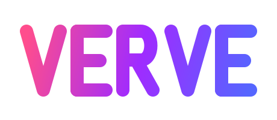

<div align="center">

<picture>
  <source media="(prefers-color-scheme: dark)" srcset="verve-assets/verve-icon-motion-dark.svg">
  
</picture>



**Full-stack pure-Zig framework for web _and_ native desktop apps.**

📚 **[verveframework.dev](https://verveframework.dev)** · [Guides](docs/README.md) · [Examples](examples/README.md) · [Changelog](CHANGELOG.md) · [Roadmap](ROADMAP.md)

</div>

> ⚠️ **Pre-1.0 — work in progress.** Verve is at v0.53.x. Public
> APIs are not stable and **will** break between minor versions.
> All three desktop backends (macOS, Windows, Linux GTK4) are validated
> on real hardware (current as of v0.53.x). Known limitations: desktop auto-updater
> apply is macOS-only; full a11y provider not yet implemented; Linux
> image clipboard returns `Unsupported`. Use for learning, experiments,
> and personal projects. Not production-ready.

Full-stack Zig framework for **both web apps and native desktop apps**.
Server-side rendering with fine-grained reactivity, a wasm32-freestanding
client runtime that hosts the real Signal/Effect graph, per-island WASM
code-splitting, and a single-binary distribution. The same component
tree, reactive runtime, and asset pipeline drive an HTTP server *or* a
native window backed by the OS webview (WKWebView / WebView2 /
WebKitGTK) — pick the target at `zig build` time. No VDOM. No macros.
No Chromium. No Electron. No third-party dependencies.

Targets **Zig 0.16.0**. Full documentation lives at **[verveframework.dev](https://verveframework.dev)**.

```sh
# Web app — HTTP server + wasm hydration
zig build                           # native server + wasm client + per-island chunks
zig build test --summary all        # 1,353 tests across core + server + client + desktop + integration
zig build docs                      # zig-out/docs/api/index.html — Zig autodoc for the public verve module
./zig-out/bin/verve-server          # open http://127.0.0.1:8080

# Desktop app — native window + system webview, no HTTP server, no Chromium
./zig-out/bin/verve-cli new ~/my-app --desktop && cd ~/my-app && zig build run
```

## Why Verve

Most web frameworks force a trade between **time-to-first-byte** (SSR), **interactive feel** (client-side reactivity), and **operational shape** (one binary vs. a Node/Bun/Deno toolchain alongside a backend service). Pick two; live with the third. Most *desktop* frameworks force a different trade — Electron's 150 MB Chromium bundle, Tauri's split Rust + JS toolchain, native Swift/Kotlin/C# locked to one OS, or a webview wrapper without a real component model.

Verve is the bet that you can have all three web targets *and* desktop, in **pure Zig**:

- **SSR-first.** Pages render server-side as `*Node` trees streamed straight to the socket. Search engines and noscript clients see real content. No hydration handshake required to read the page.
- **Real reactivity on the client.** The same `Signal` / `Effect` / `Owner` / `Resource` graph the server uses ships into a wasm32-freestanding client runtime. DOM updates are a *consequence* of `Signal.set` — not a parallel write path tacked on for "JS interactivity."
- **One binary, two surfaces.** `zig build` produces either an HTTP server with the WASM client, per-island chunks, JS bridge, public assets, and manifest baked in — *or* a native desktop binary opening a system webview, with the build-time-SSR'd page + the same wasm hydration served from the embedded asset table via a `verve://` URL scheme. No Chromium, no Node runtime, no bundler config. Deploy by `scp` either way.
- **Pure Zig.** Zero third-party Zig dependencies. The framework, scaffolder, server-fn codegen, island chunker, and reactive runtime are all pure Zig in this repo, behind the same `zig fmt` rules. The desktop backends bind the native platform webview (objc runtime for WKWebView, a native C++ host for WebView2, GTK 3 + WebKit 4.1 for Linux) — all in-tree, compiled by the bundled `zig cc`, no external SDK fetch.

If the goal is to ship a server-rendered, reactive web app with the operational profile of a Go binary and the type ergonomics of a hand-written `view!` macro — *or* a native desktop app that doesn't bundle a whole browser — without taking on Rust's compile times, npm's lockfile churn, or React's hydration cost, that's what Verve exists for.

## Why "Verve"

**Verve**: *vigor, spirit, energy of expression*. A reactive update arrives with no waiting — `Signal.set` and the DOM is already different. The framework's job is to keep that feeling honest from the first byte the server flushes to the last keystroke a user types into a hydrated input.

It's also short, unique on crates.io / npm / pypi (none of which Verve ships to), and easy to type. The bigger half of the meaning, though, is the energetic one: the framework is opinionated about *not* getting in the way of code that wants to react instantly.

## What's in the box

### Routing + rendering
- Comptime route parser with **path parameters** (`/work/:slug`), **wildcards** (`/files/*rest`), and **nested layouts** with `ctx.outlet()`.
- **ProtectedRoute** guards + **Redirect** sentinel (`ctx.redirect("/login")`).
- **`useLocation`** — `ctx.location` with lazy query parsing + `isActive`.
- `RequestMeta` exposes cookies, Accept-Language, User-Agent, Origin, Host.

### Reactivity (server + WASM client)
- **Signal / Effect / Store / Resource** — full SolidJS/Leptos-style runtime, shared between server-side render and the WASM client.
- **Owner tree** with `on_cleanup` (LIFO disposal); `verve.cleanup(handler)` registers teardown hooks against the runtime's root Owner.
- **`untrack` / `batch`** escape hatches.
- **Typed NodeRef** + `data-ref` markers; `verve.queryRef(ref)` resolves to a JS-owned element handle, and `setRefText` / `setRefAttr` / `setRefValue` / `setRefClass` / `focusRef` / `removeRef` / `refValueI32` / `refValueF32` mutate or read the live element by handle.
- **Reactive ErrorBoundary** — `Signal(?anyerror)` with `captureError` / `reset`.
- **Client-side runtime** — the wasm bundle hosts the real reactive graph. `registerI32` / `registerStr` / `registerBool` / `registerF32` allocate Signals whose `on_set` hook drives DOM updates. Per-frame scratch allocator keeps memory bounded across re-runs.
- **Typed bindings + auto-walker** — `Node.bindI32` / `bindStr` / `bindBool` / `bindF32` stamp `data-vh-type` + `data-vh-initial` on the rendered element; the bridge JS walks every `[data-vh-type]` after instantiation and calls the matching `verve_register_<kind>` export. Apps no longer need to ship per-binding `verve_init_<name>` exports.
- **Declarative `autoHydrate(bindings)`** — alternative to typed bindings; pass a slice of `Binding { name, initial }` and the runtime dispatches to the right registrar per entry.
- **Idempotent register***. Second `register*` call with the same name returns the existing slot — safe for multi-instance islands and hot-reloaded chunks.
- **Closure-style event handlers** — `verve.registerEvent(fn)` returns a `u32` slot id; stamp via `Node.onClickFn` / `onSubmitFn` / `onInputFn` / `onChangeFn` / `onKeydownFn` at render time. Bridge JS delegates route through `verve_event_dispatch(id)`; handler runs in WASM with whatever state it captured at registration.
- **Slot-table introspection** — `slotCount` / `slotName(idx, buf)` / `slotKind(idx)` + the event-slot variants. Caps at 256 signal slots + 1024 event slots.
- **Keyed-list reconciler** — LIS-based planner emits the minimum (insert | move | remove) op sequence; `ForEachHandle` caches key order so subsequent updates only diff the delta.

### Head + components
- **Head slot accumulator** — `ctx.setTitle / metaTag / linkTag / jsonLd` with explicit priority + replace-not-append semantics.
- **`provide` / `use` DI** through the owner chain.
- **Slot / SlotMap** — named children API.
- **`show` / `forEach` / `portal`** — control-flow helpers (server + reactive client-side via the reconciler).

### Auth + security
- **CSRF** — HMAC-SHA256 token, auto-issued cookie + `__csrf` form field. `ctx.actionForm` injects the field automatically.
- **CSP nonce** — per-request 12-byte hex nonce in `Content-Security-Policy: script-src 'nonce-…' 'strict-dynamic'`.
- **Origin pinning** on form POSTs.
- **`SameSite=Strict`** on the CSRF cookie.

### SSR + client
- Streaming SSR via `std.http.Server`, chunked transfer-encoding, no full-body buffering.
- **`ctx.fetch`** wrapper around `std.http.Client`.
- **`ctx.serverFn`** — server-side direct call into `app.Actions`.
- **Typed server-fn client stubs** — `build.zig` codegen walks `app.Actions` at build time and emits `app_client.zig` with `<name>(arena, args)` (native, typed return), `<name>_post(arena, args)` (fire-and-forget JSON POST, WASM-callable), and `<name>_call(arena, args, on_reply)` (typed correlated-callback; native sync, wasm threads a request id for a round-trip reply).
- **Out-of-order Suspense streaming** — `Renderer.streamRender` flushes the shell first, then drains parked boundaries as `<template id="verve-vs-N">{real}</template>` + `verveSwap(N)` chunks. `withStreamRegistry` activates the threadlocal for a build's scope.
- **SPA navigation** via `verve.link` — delegated click intercept, head merge, body swap, prefetch-on-hover, popstate handler.
- **Growable WASM heap** (`@wasmMemoryGrow`) + 256 KB per-frame scratch region for reconciler scratch.

### i18n
- `verve.I18nCatalog` + `resolveLocale` — cookie → query → Accept-Language → default with language-prefix fallback.
- **RTL direction** — `verve.i18nIsRtl(locale)` / `verve.i18nDir(locale)` return whether a locale is right-to-left and its CSS `dir` value (`"rtl"` / `"ltr"`).
- **CLDR cardinal pluralization** — `verve.PluralCategory` (`.zero` / `.one` / `.two` / `.few` / `.many` / `.other`), `verve.pluralCategory(locale, n)`, and `verve.tPlural(catalog, locale, key_base, n, args)` for pluralized translations.

### Assets
- Static asset routing at `/public/*` — runtime (`--public-dir`) or comptime-embedded (`-Dpublic-dir=…`).
- **Hashed URLs**: `/public/style-d5a73163.css` with `Cache-Control: public, max-age=31536000, immutable`. `ctx.assetHref("style.css")` resolves to the hashed form.
- **mtime-aware LRU** for `--public-dir` reads.
- **Precompressed `.br` / `.gz`** siblings served when present.

### Islands (per-island WASM chunks)
- `verve.island(ctx, opts, inner)` emits `<verve-island data-name=… data-props=…>` markers.
- **Build-time manifest codegen** walks `app.islands` at comptime and emits `client_manifest.zig` listing every island's name, props schema, and chunk URL.
- **Per-island WASM chunks** — `build.zig` parses `src/app/islands.zig` and builds one chunk per declared island (`src/client/islands/<Name>.zig` for custom logic, `_default.zig` as a shared stub).
- **Shared linear memory** — chunks import their memory from the main `client.wasm` via `env.memory`, dropping per-chunk size to **~73 bytes** for stubs (~290 B for chunks that ship real logic) vs. ~180 B standalone. Total bytes-on-wire stays flat as you add more islands.
- **Lazy dispatch** — JS bridge fetches each chunk on first encounter, caches the instantiation, copies props through shared scratch, and calls `hydrate(ptr, len, vid)`.
- **Chunk-side reactive runtime** — chunks `@import("verve")` (the chunk-side façade) and call `registerI32` / `signalSetI32` / `signalGetI32` / `queryRef` / `setRefText` / `cleanup` / etc. via a `verve_runtime` import the bridge JS resolves against the main client's exports at instantiation. Per-island Signal registration without bouncing through the main client.
- **Closure-style events from chunks** (table-isolated) — `verve.registerEvent(&handler)` from a chunk lands in the main runtime's event-slot table and `call_indirect` dispatches it. Function tables are **isolated**: the main client imports a JS-owned growable `__indirect_function_table`, each chunk instantiates against a private table, and the bridge translates fn-pointer indices crossing the boundary (registerEvent, timers, response/drop handlers) into freshly grown main-table slots — a chunk's element segment can never clobber the main client's entries.
- **Multi-instance islands** — the framework auto-namespaces every `z-bind` / `data-ref` inside an island as `name__v{vid}` at SSR time. Two instances of the same component are fully independent with no author burden; `hydrate(props_ptr, props_len, vid)` receives the document-order `vid` assigned by the bridge.
- **Typed props** — `verve.encodeProps(ctx, Props{...})` serializes a typed struct to base64 (binary codec in `src/core/props.zig`) for the server; `verve.decodeProps(Props, bytes, alloc)` reconstructs it chunk-side from `data-props`. `props_schema` is optional documentation, not the wire contract.
- **Island resource-state hydration** — `ctx.islandState(fields)` / `ctx.islandStateStruct(key, value)` server-side embed state in `<script type="application/verve-state">`; chunks read it back with `verve.resourceFromState(T, owner, key)` (returns a `.ready` Resource, no re-fetch) or `verve.islandStateValue(T, key)` (raw primitive).
- **Per-island + route lifecycle** — `verve_unmount_route()` disposes all island state on SPA route changes; `verve_unmount_island(vid)` tears down a single island instance. The bridge wires both via MutationObserver; `data-vid` is stamped automatically.

### Downstream wasm clients (`verve_client` module)
- **`verve_client`** is a sibling module published from `build.zig` alongside `verve` — re-exports every reactive primitive a wasm client needs (Signal / Effect / Owner / Action / Resource / Store / ErrorBoundary), the DOM-wired adapter (`registerI32` + variants, `bindForEach` / `applyReconcile`, NodeRef ops, closure events, cleanup, slot introspection), and the SPA navigation + control-flow + suspense + i18n helpers.
- **Drop-in for downstream apps** — the desktop template imports it as `@import("verve")` from its wasm client; downstream apps written against the same `verve_client` surface compile against both web and desktop targets unchanged.
- **Bundled with the desktop scaffold** by default. `templates/desktop/src/client/main.zig` ships only the click handlers — every binding is registered automatically by the auto-walker.

### Client runtime (wasm app primitives)
Wasm-side primitives so app logic lives in Zig instead of an inline `<script>` blob. All chunk-callable; one shared `std.json` parser in the main client keeps chunks tiny. Guide: [`docs/20-client-runtime.md`](docs/20-client-runtime.md).
- **Typed IPC replies** — `verve.serverFnPost(route, body)` + `verve.parseJson` / `verve.readStruct(Reply, doc, alloc)`. One parser in the main client (`verve_json_*`); chunks read typed replies without a per-chunk JSON scanner. Server-side `app_client.<name>_call(arena, args, on_reply)` mirrors the shape.
- **Events with data** — handlers read `eventMods()`, `eventKey(buf)`, `eventTargetAttr(name, buf)` (the element's `data-*`), `eventCoordX/Y()`, `eventDeltaY()` / `eventButton()`, and call `eventPreventDefault()` / `eventStopPropagation()` / `eventCapturePointer()` (pointer capture: the gesture keeps receiving move/up after leaving the element). Delegated event set includes `wheel`, the full `pointer*` family (incl. `pointercancel`), and `dblclick`, each with a fluent `Node.on*` stamp.
- **Server push to chunks** — `pushSubscribe(channel, island, export_name)` delivers every SSE frame from `/push?channel=…` to a NAMED chunk export (payload staged in island scratch); `pushUnsubscribe` drops it; `fetchToExport(api, island, export_name)` is the one-shot POST→export resync hook. All host-call based — zero indirect-function-table entries.
- **Named-export animation loop** — the `verveRafNamed` host fn drives a JS `requestAnimationFrame` loop against a named chunk export (`fn () i32`, nonzero = continue); chunk animation without taking a function pointer.
- **Timers / storage / clipboard** — `setTimeout` / `setInterval` / `requestAnimationFrame` / `queueMicrotask` / `clearTimer`, `storage.{get,set,remove,len}` over `localStorage`, `clipboardWrite`.
- **Forms + DOM measurement** — `refValueStr`, `refRequestSubmit`, `refSelect`, `refBlur`, `refScrollIntoView`, `refRect()`, `viewport()`, `matchMedia(query)`, `formCollect(bind, buf)` → JSON for `readStruct`.
- **Generic JS interop** — `host(name, args, out)` (sync) + `hostAsync(name, args, route)` (replies via the response-handler path). Apps register functions in `window.verveHost` — the supported hook for browser APIs Verve doesn't own (Intl, canvas).
- **Chunk-local arena** — `chunkArena()` is a real `std.mem.Allocator` over a main-client bump region; `chunkArenaMark` / `chunkArenaReset` recycle per dispatch instead of pre-sizing static buffers. `registerDrop(bind, handler)` + `currentDrop(buf)` deliver dropped-file bytes to wasm.

### Visualization (`verve.viz`)
Native, pure-Zig, declarative graphs + charts — no d3, no cytoscape, no canvas. Layout computed in Zig (server-side or in wasm), output is an SVG `Node` tree through the normal renderer, so every chart works with JS off. Guide: [`docs/22-visualization.md`](docs/22-visualization.md). Demos: the `/viz` route (`zig build run`) and the standalone live-streaming app [`examples/viz-live/`](examples/viz-live/README.md).
- **15 chart types** — bar (plain/stacked/grouped), line, area, scatter, pie/donut, candlestick, box plot, heatmap, radar, violin, **sankey**, **treemap** (squarified), **chord** — plus scales (linear/band/log/time), axes with nice ticks, and a resolution-independent scene model for custom SVG viz.
- **Node-link graphs** — tree, radial, force-directed, and layered DAG layouts (Sugiyama crossing minimization, virtual-node edge routing with **straight / curved / orthogonal** edge styles via `GraphOpts.edge_routing`).
- **Interactive graph island** — wheel zoom, pointer-captured pan/drag (gestures survive leaving the svg), hover tooltips, click select, **double-click subtree collapse** (`+N` badge), runtime add/remove of nodes under **any layout** (deterministic layouts recompute client-side via the `viz_core` chunk module and tween to their new positions).
- **Live data over SSE push** — the server diffs its graph and broadcasts seq-ordered **wire deltas** (`viz.diffGraphs` / `writeDeltaJson` / `applyDeltaOps`) on a push channel; the island applies them in order and resyncs via a snapshot on any gap. Polling fallback when EventSource is unavailable.

### Animation (`verve.anim`)
GSAP-class animation engine, pure Zig + one hand-written JS interpreter — no GSAP, no Framer Motion. Zig builds and serializes versioned JSON descriptors (declarative SSR `Node.animate(...)` or imperative island `verve.animPlay`); the bridge owns the rAF loop and style writes. Frozen wire contract via serializer goldens + node conformance tests. Guide: [`docs/23-animation.md`](docs/23-animation.md). Demos: the `/anim` and `/smooth` routes (`zig build run`).
- **Core engine** — tweens, timelines (labels + position arithmetic), keyframes, 31 easings, grid/distribution stagger, dynamic per-target values, wasm fn modifiers, control API (pause/reverse/seek/timeScale/progress), and built-in `prefers-reduced-motion` handling (jump-to-end, overridable per tween).
- **ScrollTrigger + Observer** — enter/leave toggle actions, scrub (exact or smoothed), pins with layout-preserving spacers, viewport-relative start/end specs, markers, zero-wasm class reveals (`anim.reveal`), **snap-to-progress** (step or points; idle-detected native-scroll glide, configurable ease + directional bias), **element scroller** (`scroller`/`scroller_handle`), and a normalized wheel/touch/pointer Observer with velocity.
- **ScrollSmoother** — native-scroll-preserving smoothing (fixed wrapper + translated content + height spacer — scrollbar, keyboard, anchors, and a11y stay native while the visual eases), `data-speed`/`data-lag` parallax, transform pins, touch-native by default.
- **MotionPath + MorphSVG** — full SVG `d` parser (arcs, reflections, relative commands) → arc-length-uniform sampling with tangent rotation and `.align_to = .start` re-basing; shape morphing with subpath matching, de Casteljau equalization, and cyclic start alignment; islands can morph **from the live shape** (`verve.refGetAttrArena`).
- **Draggable** — axis locks, bounds (selector or rect), grid/point snap, **analytic inertia throws** (velocity-continuous endpoint projection), **elastic bounce** off bounds (`bounce` elasticity 0..1), drop zones with hover class + `on_drop`, pointer-capture gestures that keep inner clicks working.
- **Sortable** — drag-to-reorder lists with FLIP-animated sibling shifts, cross-list group transfer, edge autoscroll, and `SortableHandle` observability (`lastFrom`/`lastTo`/`fromContainer`/`toContainer`).
- **SplitText + FLIP** — chars/words/`graphemes` (UAX#29 extended grapheme clusters, zero JS) split **server-side**; `rtl_aware` wraps RTL runs in `<span dir="rtl">`; line grouping at hydrate; FLIP layout animation with optional **nested counter-scale** (`counter_scale`) over the keyed reconciler.

### 3D engine (`verve.gl`)
Native 3D, pure Zig + two hand-written interpreters (**WebGL2 and WebGPU**) — no three.js. The whole engine (scene graph, transforms, draw ordering, lighting, asset parsing) runs in wasm and emits a flat binary command stream into linear memory; each backend walks the same bytes with zero-copy typed-array views. Backend chosen at runtime (WebGPU when `navigator.gpu` is present, WebGL2 otherwise). Wire contract frozen by byte-exact golden tests (the anim `serialize.zig` pattern). Guide: [`docs/24-gl.md`](docs/24-gl.md). Demos: `/gl`, `/gl-scene`, and the per-feature `/gl-*` routes (`zig build run`).
- **Engine core** — column-major f32 math, struct-of-arrays scene graph with pre-order dirty propagation, one API-neutral command stream driving both backends, per-submesh shader-variant selection, frustum culling (camera + shadow-light), BVH picking, orbit controls, **orthographic or perspective projection**, and declarative `ctx.glScene` scenes.
- **GPU instancing** — one draw covers thousands of instances with per-instance transforms, non-uniform-scale-correct normals, multi-submesh support, **per-instance frustum culling**, and instanced shadow casting. Demos: `/gl-instanced`, `/gl-instanced-cull`, `/gl-instanced-multi`, `/gl-instanced-shadow`.
- **Primitives beyond triangle meshes** — **points & sprites** (screen-space billboards), **fat lines** (`Line2` / `LineSegments2`, wide 3D segments), and **forward decals** (`DecalGeometry`, project a texture onto surfaces). Demos: `/gl-points`, `/gl-lines`, `/gl-decals`.
- **Materials** — PBR metallic-roughness + image-based lighting (IBL), emissive, double-sided, and alpha **BLEND** / **MASK** (alpha-test cutout, with hole-accurate cast shadows) modes; **wireframe** rendering; and **user clipping planes** (`GlSceneBuilder.clipPlanes`). Demos: `/gl-material`, `/gl-wireframe`, `/gl-clip`.
- **Custom shader materials** — comptime-baked injection hooks (5 fragment + vertex stages), a Custom UBO, custom textures, and a live `glmat_set` setter, both backends — author bespoke shading without forking the über-shader. Demo: `/gl-material`.
- **Lighting** — directional / spot / point lights with simultaneous multi-light **shadow casters** (tiled 2D + cube atlases), **cascaded shadow maps** for directional light, and **rect area lights** via Linearly Transformed Cosines with soft area shadows.
- **Skeletal skinning** — GPU skinning with keyframe animation, multiple clips + switching, cross-fade and weighted blending, ping-pong / loop / once modes, scrub, and all glTF interpolation modes (step / linear / cubicspline). Demos: `/gl-skin`.
- **Morph targets** — GPU blend shapes with POSITION + NORMAL + **TANGENT** deltas (correct normal-mapped morphing), up to **32 simultaneous active influences**, cubic-Hermite weight easing, and a **combined skinned + morph** variant (morph deltas applied to local space, then the skin matrix — glTF order). Demos: `/gl-morph`, `/gl-morph16`, `/gl-skin-morph`.
- **Level of detail (LOD)** — a single `.vmesh` packs multiple LOD levels with squared-distance thresholds; the runtime selects the active level per object by camera distance and narrows every draw pass (opaque, transparent, shadow) to it. Demo: `/gl-lod`.
- **Image quality** — bloom + FXAA, a depth + view-space-normal prepass (G-buffer), **SSAO**, **screen-space reflections (SSR)**, **depth of field**, **weighted-blended OIT** (order-independent transparency), selectable tone-mappers (ACES / AgX / Reinhard / Reinhard-extended / Uncharted2 / linear), and vignette. Demos: `/gl-ssao`, `/gl-ssr`, `/gl-dof`, `/gl-oit`, `/gl-tonemap`, `/gl-post`.
- **Reflection probes** — a probe renders the scene into a cubemap from a fixed position, **GGX-prefilters** it into a roughness mip chain, and binds it as the specular IBL source, so a reflective model mirrors its **actual surroundings** rather than a static environment map. Static capture-once; both backends. `ctx.glScene(…).probe(pos)`. Demo: `/gl-probe`.
- **Compressed textures** — build-time-encoded (no runtime transcode) **KTX2 / BC7** (mode-6, ~4:1 VRAM) with host-transparent PNG fallback, plus **S3TC** (BC1 opaque / BC3 alpha) siblings for GPUs without BPTC. Runtime picks the best supported format per device caps; both backends. Pure-Zig BC1/BC3/BC7 encoders.
- **Asset pipeline** — build-time `.glb` → packed `.vmesh` (`tools/gl_asset_gen`): zero runtime parsing, fetch → linear memory → GPU upload. Pure-Zig PNG decoder, glb parser, and vmesh reader, all hardened against hostile input (errors, never panics). **Draco-compressed glTF** (`KHR_draco_mesh_compression`) is decoded at build time (pure-Zig, zero-dep) into the same pipeline. `verve.anim` fusion drives scroll-scrubbed 3D. Demos: `/gl-draco`, [`examples/gl-viewer/`](examples/gl-viewer/README.md).
- **Geometry compression (`.vmesh` v16/v17)** — index buffers compress losslessly (delta+zigzag+varint, ~50%) and vertex buffers via quantization (pos u16 / normal+tangent i8 / uv u16, ~65%), decoded host-side before upload; **GPU-resident quantized attributes** (half pos/uv + snorm8 normal/tangent) additionally cut VRAM ~58% by uploading the packed form directly. Total assets shrink **~32–46%** (lodsphere 116→79 KB). Pure-Zig codec; native round-trip + WebGL2 visual gate.

### AI tools (`verve.ai`)
Expose an app's own typed functions to a language model as callable tools, then run a
bounded tool-use loop against them — pure Zig, zero third-party deps, reusing the same
`Actions` namespace `POST /api/<fn>` already dispatches through. Guide:
[`docs/25-ai.md`](docs/25-ai.md). Demo: `/ai-chat`.
- **Comptime, default-deny allowlist** — a function is callable by a model only if it's
  named in an explicit `[]const verve.ai.ToolDecl`; a typo'd `fn_name`, a stale
  `arg_docs.field`, or an unrepresentable argument type is a build failure
  (`@compileError`), never a runtime surprise. JSON Schema generated from the function's
  own struct argument type at comptime — zero runtime cost.
- **`Risk` tiers** (`safe` / `mutating` — the default — / `dangerous`) enforced by a
  shared policy gate (allowlist → size → risk → confirmation) that both HTTP actions
  (`Registry`) and desktop IPC routes (`RouteRegistry`) dispatch through identically —
  one gate, not two copies that can drift.
- **Confirmation round-trip for dangerous calls** — a single-use, `(tool, args)`-bound
  token that never reaches the model (minted for a human-facing approval UI only); a
  token issued for one tool cannot authorize another, and a mismatched claim is audited
  distinctly from a routine first-time ask.
- **Audited dispatch** — every call outcome (allowed / denied / needs-confirmation /
  failed) is recorded, without ever logging raw argument content.
- **Pluggable providers** — a live Anthropic Messages API client
  (`verve.ai.anthropic.Client`), a scripted `MockProvider` for deterministic tests/CI
  (no API key, no network), and on desktop a Claude Code CLI provider that delegates to
  its own sandboxed tools and refuses outright rather than silently dropping a
  declared tool list.
- **`/ai-chat` demo** — a tool-calling chat UI over a 4-function allowlist; the
  transcript is fetched entirely through the server action (never passed as island
  props, which are capped at 8 KB).

### Markdown & syntax highlighting
Pure-Zig, server-side — replaces third-party `marked` / `highlight.js`. Parsed at SSR time into the `Node` tree; no client wasm, no JavaScript. Guide: [`docs/21-markdown-and-highlighting.md`](docs/21-markdown-and-highlighting.md). Demo: [`examples/markdown/`](examples/markdown/README.md).
- **`ctx.markdown(src)`** — GFM: CommonMark core + tables, task lists, strikethrough, autolinks, reference links. Returns a real `Node` subtree, so text is escaped by the one renderer escaper.
- **`ctx.codeBlock(src, lang)`** — hand-written tokenizers for Zig, JS/TS, JSON, HTML/CSS, Bash, Markdown + generic fallback; stable `tok-*` classes themed by `verve.highlightThemeCss` (light/dark). Markdown fenced code auto-highlights.
- **Safe by default** — link/image URLs filtered by `verve.sanitizeUrl` (rejects `javascript:`, `data:`, control-char bypasses); raw HTML in source is stripped.

### Dev + ops
- **`--dev`** auto-reload: injects a WS-disconnect-reconnect script. Pair with `zig build --watch run -- --dev`.
- **`--csrf=enforce|disable`** flag (default enforce).
- `/events` SSE + `/ws` bidirectional WebSocket + `/push?channel=…` generic SSE broadcast hub (`push.publish(channel, bytes)`, 32-frame resume ring, `Last-Event-ID` replay).
- `/health` (uptime + request count) + `/metrics` (per-route latency JSON).
- Per-connection worker pool with bounded admission (`--workers N`).
- LISTEN_FDS env-var support for systemd socket activation.
- Graceful shutdown on `SIGINT` / `SIGTERM`.

### Desktop apps (no Chromium, no Electron)
- **Native window + system webview** — WKWebView (macOS), WebView2 (Windows), WebKitGTK (Linux). Cross-platform `Window` surface in `src/desktop/`; per-OS backend behind a comptime dispatcher.
- **Same SSR pipeline as the server** — `verve.Renderer.render` produces `index.html` at build time; tied into `public_assets` via an overlay arg so on-disk files stay static-only.
- **WASM hydration** — `src/client/main.zig` compiled to `wasm32-freestanding` (ReleaseSmall, ~470 B for the demo), served at `verve://app/client.wasm`. A stripped bridge (`verve_desktop.js`) instantiates it and dispatches `[z-on-click]` to wasm exports.
- **Typed IPC** — `desktop.Router(Ctx, Routes)` with comptime `Args` + `Reply` types; JS callers `await window.verve.request({type, ...})` and get a typed Promise back.
- **Cookies** — per-window `CookieStore` with real implementations on all three backends (sync wrappers over the native async cookie managers via nested run-loop pumps).
- **Clipboard** — `Window.clipboard().writeText(s)` / `.readText(alloc)` / `.writeHtml(html)` against `NSPasteboard` (macOS), `CF_UNICODETEXT` / `CF_HTML` + HGLOBAL (Windows), and `GtkClipboard` on the CLIPBOARD selection (Linux). `.writeImage(png)` / `.readImage(alloc)` for PNG bitmaps (macOS + Windows via WIC `CF_DIBV5`; Unsupported on Linux).
- **Multi-window** — `Window.openChildWindow(opts)`; last-window-quit semantics on all three platforms.
- **Single-instance enforcement** — `desktop.single_instance.acquire(alloc, "my-app")` returns a `Lock` held for process lifetime. POSIX `flock` on macOS + Linux, `CreateMutexW` under `Local\` on Windows.
- **Color-scheme follow** — `Window.colorScheme()` returns `.light` / `.dark` / `.unknown` from the OS preference; `Window.setColorSchemeHandler(cb, ctx)` fires live on toggle (NSDistributedNotificationCenter / WM_SETTINGCHANGE / GtkSettings notify).
- **Native dialogs / alerts** — `openFileDialog`, `saveFileDialog`, `showAlert` wired against the system picker on all three backends (NSOpenPanel/NSSavePanel/NSAlert on macOS, `GtkFileChooserNative` + `GtkMessageDialog` on Linux, `GetOpenFileNameW` / `GetSaveFileNameW` + `MessageBoxW` on Windows). **Native menu bar (macOS)** — default App+Edit+Window menus (Edit menu is what makes Cmd+C / Cmd+V fire inside WKWebView text inputs).
- **Window snapshot** — `Window.takeSnapshotPng(path)` on all three backends (WKWebView snapshot → NSBitmapImageRep on macOS; `webkit_web_view_get_snapshot` → cairo PNG on Linux; `ICoreWebView2::CapturePreview` → IStream → `WriteFile` on Windows).
- **macOS `.app` bundle** — `zig build bundle` lays out `Info.plist` + `MacOS/<name>`; `-Dbundle-id` / `-Dbundle-version` / `-Dicon=<path-to-icns>` / `-Dcodesign=<identity>` / `-Dhardened=true` (hardened runtime + WKWebView entitlements) flags.
- **Auto-updater** — `desktop.updates.checkForUpdate` (all 3 backends, pure stdlib JSON feed compare) + `applyUpdate` (macOS-only: SHA-256 verify + same-volume rename swap + `open -n` relaunch). Win + Linux apply paths remain platform-updater territory.
- **Level-3 golden-diff smoke** — `zig build smoke` runs the app under `--smoke`, drives a deterministic interaction sequence, captures a PNG via `Window.takeSnapshotPng`, diffs a DOM checksum vs `tests/golden/`.
- **Dev-loop watcher** — `zig build dev` polls watched sources and respawns the app on change.
- **`--dev <dir>` hot-reload** — runtime asset fallback in the scheme handler. Edit `frontend/style.css` or `frontend/verve_desktop.js`, reload with Cmd+R, see the change without a rebuild. Path traversal rejected; 16 MB per-file cap.
- **Vendored WebView2, native C++ host** — the Windows backend is a native C++ WebView2 host (`src/desktop/win_native/webview2_host.cpp`) behind a flat C ABI; the WebView2 SDK header + x64 `WebView2Loader.dll` are vendored in-tree, so builds (including cross-compiles) need no network fetch and ship the loader next to the `.exe`. Requires the WebView2 **Evergreen Runtime** at runtime (preinstalled on Windows 11; on Windows 10 install Microsoft's bootstrapper).

See **[docs/19-desktop.md](docs/19-desktop.md)** for the full feature
tour and platform support matrix.

## Install

> Pre-1.0 — release artifacts are published for each tag, but
> behavior is experimental. All three desktop backends (macOS,
> Windows, Linux GTK4) are validated on real hardware (current as of v0.53.x).

Tagged releases publish `verve-server` + `verve-cli` tarballs for
five targets:

- `x86_64-linux`
- `aarch64-linux`
- `x86_64-macos`
- `aarch64-macos`
- `x86_64-windows`

```sh
VERSION=0.53.1
SUFFIX=x86_64-linux        # or aarch64-linux / x86_64-macos / aarch64-macos / x86_64-windows
curl -fsSL "https://github.com/sirhco/verve/releases/download/v${VERSION}/verve-${VERSION}-${SUFFIX}.tar.gz" -o verve.tgz
curl -fsSL "https://github.com/sirhco/verve/releases/download/v${VERSION}/verve-${VERSION}-${SUFFIX}.tar.gz.sha256" -o verve.tgz.sha256
shasum -a 256 -c verve.tgz.sha256
tar -xzf verve.tgz
./verve-${VERSION}-${SUFFIX}/bin/verve-server --help
```

Or build from source — see [Quickstart](#quickstart) below.

The release history lives in [CHANGELOG.md](CHANGELOG.md).

## Use as a Zig package

Verve exposes a `verve` module that can be added as a dependency
of any existing Zig project.

### Add the dependency

```sh
zig fetch --save git+https://github.com/sirhco/verve#v0.53.1
```

This writes the `verve` entry into your `build.zig.zon` with the
URL + computed hash pinned. Then wire it up in `build.zig`:

```zig
const verve_dep = b.dependency("verve", .{
    .target = target,
    .optimize = optimize,
});
exe_mod.addImport("verve", verve_dep.module("verve"));
```

Now `@import("verve")` resolves inside your app code. The same
`verve` module powers both the web server (`src/server/`) and the
desktop scaffold's SSR pipeline.

For wasm-target client code (the `src/client/main.zig` of a
downstream app), use the sibling `verve_client` module — it carries
the DOM-wired adapter, slot-table API, NodeRef ops, closure events,
and cleanup hooks in addition to the reactive primitives:

```zig
const wasm_target = b.resolveTargetQuery(.{
    .cpu_arch = .wasm32,
    .os_tag = .freestanding,
});
const verve_client_mod = verve_dep.module("verve_client");

const client_mod = b.createModule(.{
    .root_source_file = b.path("src/client/main.zig"),
    .target = wasm_target,
    .optimize = .ReleaseSmall,
    .imports = &.{
        .{ .name = "verve", .module = verve_client_mod },
    },
});
```

Then the wasm client writes:

```zig
const verve = @import("verve");

export fn increment_counter() void {
    if (verve.signalI32("count")) |c| c.increment();
}
```

No `verve_init_*` / `verve_hydrate` boilerplate when the SSR side
uses `.bindI32("count", 0)` — the auto-walker registers
every typed binding from the rendered HTML.

### Scaffold a new app pinned to a release

`verve-cli` can pin scaffolded `build.zig.zon` to a tagged
release instead of a path dep:

```sh
verve-cli new ~/my-app --release v0.53.1 \
                       --release-hash <multihash-from-zig-fetch>
```

When `--release-hash` is omitted, the generated `build.zig.zon`
ships with a commented `.url + .hash` block plus a `path = "../verve"`
fallback so you can run `zig fetch --save <url>` once and let
Zig compute the hash.

## Quickstart

```sh
zig version                              # expect 0.16.0
zig build                                # produces zig-out/bin/verve-server
zig build test --summary all
zig fmt --check build.zig src tests

./zig-out/bin/verve-server --help        # CLI surface
./zig-out/bin/verve-server               # boots on 127.0.0.1:8080
```

Then open:

- <http://127.0.0.1:8080/> — landing page
- <http://127.0.0.1:8080/counter> — live counter (WASM reactive runtime drives DOM, WS bidirectional sync)
- <http://127.0.0.1:8080/todos> — pure server-rendered todo list (no wasm needed)
- <http://127.0.0.1:8080/work/hello-world> — path-parameter + per-page head slots demo
- <http://127.0.0.1:8080/app/dashboard> — nested layout route
- <http://127.0.0.1:8080/viz> — `verve.viz` charts + node-link graphs (SVG, JS-off)
- <http://127.0.0.1:8080/anim> — `verve.anim` engine: tweens, timelines, ScrollTrigger
- <http://127.0.0.1:8080/smooth> — `verve.anim` ScrollSmoother demo
- <http://127.0.0.1:8080/gl> — `verve.gl` 3D engine (WebGPU + WebGL2, no three.js)
- <http://127.0.0.1:8080/gl-scene> — declarative `ctx.glScene` 3D scene
- <http://127.0.0.1:8080/gl-skin>, `/gl-skin-morph`, `/gl-morph` — skinning, combined skinned+morph, and morph-target demos
- <http://127.0.0.1:8080/gl-lod> — distance-based level-of-detail (LOD) mesh selection
- <http://127.0.0.1:8080/gl-instanced>, `/gl-instanced-cull`, `/gl-instanced-shadow` — GPU instancing (per-instance transforms, culling, shadows)
- <http://127.0.0.1:8080/gl-material>, `/gl-wireframe`, `/gl-clip` — custom shader materials, wireframe, user clipping planes
- <http://127.0.0.1:8080/gl-points>, `/gl-lines`, `/gl-decals` — points & sprites, fat lines, projected decals
- <http://127.0.0.1:8080/gl-ssr>, `/gl-ssao`, `/gl-dof`, `/gl-oit`, `/gl-tonemap` — image-quality demos (SSR, SSAO, depth of field, order-independent transparency, tone-mappers)
- <http://127.0.0.1:8080/gl-probe> — runtime reflection probe (GGX-prefiltered cubemap capture)
- <http://127.0.0.1:8080/gl-draco> — Draco-compressed glTF (`KHR_draco_mesh_compression`) ingest

Or run the **showcase** for a tour of every feature:

```sh
cd examples/showcase
zig build run -- --dev
```

Static-asset demo:

```sh
./zig-out/bin/verve-server --port 9000 --public-dir ./tests/public_fixture
curl http://127.0.0.1:9000/public/hello.txt
```

Comptime-embedded `/public/*` (production-shaped — files baked into the binary):

```sh
zig build -Dpublic-dir=tests/public_fixture
./zig-out/bin/verve-server                # no --public-dir; same files served
curl http://127.0.0.1:8080/public/hello.txt
```

### Desktop quickstart

The same `verve-cli` scaffolds a native-desktop project (system
webview + custom-scheme assets + SSR + wasm hydration). No Chromium
bundled. No Electron.

```sh
zig build                                 # builds verve-cli
./zig-out/bin/verve-cli new my-app --desktop --name=my_app
cd my-app
zig build run                             # opens native window
zig build dev                             # watch sources + auto-restart
zig build smoke                           # Level-3 golden-diff harness (macOS)
zig build bundle                          # macOS .app
```

Full feature tour: [docs/19-desktop.md](docs/19-desktop.md). API +
options reference: the `README.md` inside the scaffolded project.

## Writing a page

A page is a function that builds a `*Node` tree via the fluent chain. Each
method on `Node` mutates the arena-backed node and returns `*Node` so calls
compose left-to-right. The renderer streams the tree to the socket.

```zig
// src/app/components.zig
pub fn home(ctx: *const verve.Context) !*verve.Node {
    return ctx.main_().children(.{
        ctx.h1("Verve"),
        ctx.p().text("Hello from Zig."),
        ctx.p().children(.{ verve.link(ctx, "/about", "About →", .{}) }),
    }).build();
}
```

Register it in the route table — `Route.init` for leaf routes,
`Route.layout` for nested layouts:

```zig
// src/app/routes.zig
pub const routes: []const verve.Route = &.{
    verve.Route.init("/",        renderHome),
    verve.Route.init("/work/:slug", renderWorkDetail),
    verve.Route.layout("/app",   renderShell, &.{
        verve.Route.init("/dashboard",        renderDashboard),
        verve.Route.init("/settings/:section", renderSettings),
    }),
};

fn renderHome(ctx: *verve.Context) !*verve.Node {
    try ctx.setTitle("Verve");
    const body = try components.home(ctx);
    return components.page(ctx, body);   // wraps in <html>/<head>/<body>
}
```

`ctx.alloc()` returns the per-request `ArenaAllocator` if you need it
directly. Element factories on `Context` cover the common HTML tags
(`div`, `span`, `h1`–`h4`, `a`, `button`, `form`, `input`, `ul`, `li`,
`nav`, `main_`, `section`, ...); the generic `ctx.el(tag)` is the
escape hatch. Chain methods include `.class()`, `.id()`, `.href()`,
`.attr(k,v)`, `.attrFmt(k,fmt,args)`, `.text(t)`, `.textFmt(fmt,args)`,
`.textInt(n)`, `.bind(name)`, `.onClick(action)`, `.children(.{ a, b, ... })`.
Errors encountered mid-chain are deferred to the terminating `.build()`.

## Writing an Action (Zerver)

Each Action is `fn(args: struct { ... }) Ret`. The dispatcher walks `app.Actions` at comptime and routes `POST /api/<name>` to the matching function. Form-encoded bodies are URL-decoded into the struct's fields; JSON bodies are parsed via `std.json`. Return types may be `void`, `!void`, `T`, or `!T`.

```zig
// src/app/api.zig
pub const Actions = struct {
    pub fn incrementCount(_: struct {}) i32 {
        return last_count.fetchAdd(1, .monotonic) + 1;
    }

    pub fn addTodo(args: struct { text: []const u8 }) !void {
        if (args.text.len == 0) return error.EmptyTodo;
        // ...
    }
};
```

`build.zig` generates `app_client.zig` at build time with two wrappers per action:

```zig
// generated — used from server-side render code
const after = try app_client.incrementCount(ctx.alloc(), .{});

// generated — used from WASM client; serializes args to JSON,
// POSTs to /api/incrementCount via the JS bridge
app_client.incrementCount_post(scratch, .{});
```

Form submissions also auto-redirect (303) to the `Referer`, so plain `<form action="/api/addTodo" method="POST">` works without any client-side JS.

## Reactive client

Each `bind("count")` in a server-rendered tree gets a matching `data-vh="count"` attribute. On startup the WASM client registers a Signal per bind, wires its `on_set` hook to a DOM primitive, and from that point on every state change flows through the reactive graph:

```zig
// src/client/main.zig
const count_sig = runtime.registerI32("count", count_initial);

export fn increment_counter() void {
    count_sig.?.set(count_sig.?.peek() + 1);    // → on_set → DOM update
}
```

For keyed lists, `runtime.registerForEach(parent_bind, initial_keys)` returns a `ForEachHandle`; `bindForEach(handle, ctx, render_fn)` ties a list-valued computation into the reactive graph and emits the minimum (insert | move | remove) ops via the LIS-based reconciler.

## Islands

Per-island WASM chunks ship lazily — pages that don't use a particular island skip the download:

```zig
// src/app/islands.zig (build.zig discovers entries here)
pub const Counter = struct {
    // props_schema is optional documentation — the wire contract is the struct.
    pub const Props = struct { initial: i32 };
};

// src/app/components.zig
return verve.island(ctx, .{
    .name  = "Counter",
    .props = try verve.encodeProps(ctx, Counter.Props{ .initial = 0 }),
}, inner);
```

The build system fans one WASM chunk out per declared island, each importing memory from the main `client.wasm` for zero-byte runtime duplication. Custom island logic lives in `src/client/islands/<Name>.zig`; everything else picks up the shared `_default.zig` stub.

## Streaming SSR

Suspense boundaries that mark themselves `markSuspended` register a continuation on the active stream registry instead of emitting fallback inline:

```zig
const reg = verve.StreamRegistry.init(ctx.alloc());
const root = try verve.withStreamRegistry(&reg, ctx, buildPage);
try verve.Renderer.streamRender(writer, io, root, &reg);
```

`streamRender` walks the tree, then drains every parked slot as `<template id="verve-vs-{id}">{real}</template>` + `verveSwap({id})` chunks. The client `verveSwap` helper unwraps the template in place of the `<div data-vs="{id}">` placeholder.

## Runtime surface

| Method | Path | Notes |
|---|---|---|
| GET  | `/`, `/counter`, `/todos`, …       | Pages from `app.routes` (supports `:param`, `*wildcard`, nested layouts) |
| POST | `/api/<fn>`                        | Dispatched to `app.Actions.<fn>`; JSON skips CSRF, form requires `__csrf` field |
| GET  | `/client.wasm`, `/verve.js`        | Embedded client + bridge |
| GET  | `/islands/<Name>.wasm`             | Per-island WASM chunk (one per `app.islands` decl) |
| GET  | `/public/<path>`                   | Static assets (hashed URL → immutable cache, plain → max-age=300) |
| GET  | `/events`                          | Server-Sent Events (text/event-stream) |
| GET  | `/push?channel=<name>`             | Generic SSE broadcast channel (`push.publish`; `Last-Event-ID` resume) |
| GET  | `/ws`                              | WebSocket upgrade |
| GET  | `/__verve/dev_ws`                  | Dev auto-reload (only with `--dev`) |
| GET  | `/health`                          | JSON: `{status, uptime_sec, requests}` |
| GET  | `/metrics`                         | JSON: per-route count / avg_ns / max_ns |

## CLI

```text
verve-server [--host HOST] [--port PORT] [--body-limit SIZE]
             [--public-dir DIR] [--workers N] [--csrf=MODE] [--dev] [--help]
```

| Flag | Default | Notes |
|---|---|---|
| `--host`        | `127.0.0.1`      | IP literal. Use `0.0.0.0` for any interface. |
| `--port`        | `8080`           | TCP port; `0` rejected (ephemeral binding unsupported). |
| `--body-limit`  | `1m`             | Max POST body size. Accepts `k`/`m`/`g` suffix. |
| `--public-dir`  | (none)           | Serve files from `DIR` at `/public/*`, backed by mtime-aware LRU. |
| `--workers`     | `CPU * 2`        | Max in-flight connections; excess returns `503`. |
| `--csrf`        | `enforce`        | `disable` for integration tests; production should leave on. |
| `--dev`         | off              | Inject auto-reload script + accept `/__verve/dev_ws` upgrades. |
| `-h, --help`    |                  | Print usage and exit. |

### Environment

- `LISTEN_FDS=N` — adopt file descriptor 3 as the listening socket (systemd activation). `--host` / `--port` ignored when set.
- `VERVE_CSRF_KEY` — hex-encoded 32 bytes for stable CSRF tokens across restarts. Random key drawn at startup when absent.

### Build options

- `-Dpublic-dir=DIR` — embed every file in `DIR` into the binary at compile time. Served at `/public/<path>` even when `--public-dir` is not given. Runtime `--public-dir` overrides any embedded entry with the same path.

## Repository layout

| Path | Purpose |
|---|---|
| `build.zig` | Wasm32 → server pipeline; per-island chunk fan-out; codegen wiring for `app_client.zig` + `client_manifest.zig`; `-Dpublic-dir` flag |
| `tools/server_fn_codegen.zig` | Build-time codegen for typed server-fn stubs |
| `tools/island_manifest_gen.zig` | Build-time codegen for the island manifest |
| `src/verve.zig` | Public library entry — re-exports core types |
| `src/core/{node,signal,context,renderer,server_fn_gen,stream_context}.zig` | Framework primitives |
| `src/server/main.zig` | HTTP server, accept loop, CLI parser, signal handlers, `/health`, `/metrics`, `/events`, `/ws`, `/public`, `/islands/<name>.wasm`, error rendering |
| `src/server/api_handler.zig` | `/api/<fn>` dispatcher; JSON and form body parsing |
| `src/server/pool.zig` | Bounded-admission worker pool |
| `src/server/metrics.zig` | Per-route latency counters |
| `src/server/gzip.zig` | `Accept-Encoding: gzip` helper |
| `src/client/{main,runtime,reconciler,scratch,island,signal,dom}.zig` | WASM client runtime + reactive graph + keyed reconciler |
| `src/client/islands/<Name>.zig` | Per-island WASM chunk sources |
| `src/bridge/verve.js` | DOM externs, reactive primitives, SPA router, island loader, verveSwap |
| `src/app/{components,api,routes,islands}.zig` | Example application |
| `src/cli/main.zig` | `verve-cli` scaffolder binary |
| `tests/integration.zig` | E2E tests (spawn server, hit endpoints, kill) |
| `tests/public_fixture/` | Files used by the `--public-dir` integration test |
| `.github/workflows/ci.yml` | CI matrix (ubuntu + macos) — fmt check + build + test + smoke |
| `.github/workflows/desktop.yml` | Desktop backend build/test matrix (macos + ubuntu + windows) |
| `.github/workflows/release.yml` | Tagged-release tarballs for the 5 published targets |

## Scaffolding a new app

```sh
# from the Verve framework checkout — plain `zig build` produces verve-cli:
zig build                                      # builds zig-out/bin/{verve-server,verve-cli}
./zig-out/bin/verve-cli new ~/code/my-app
cd ~/code/my-app
zig build && ./zig-out/bin/verve-server        # or: zig build run
```

The scaffolder embeds the entire Verve source tree at build time and writes it into the target directory. The generated app is self-contained — no Zig package-manager dependency, no git clone.

## API reference

`zig build docs` runs Zig's built-in autodoc generator over
`src/verve.zig` and writes a static bundle to `zig-out/docs/api/`:

```sh
zig build docs
open zig-out/docs/api/index.html        # macOS — or any browser
# or serve over HTTP for the live search:
python3 -m http.server -d zig-out/docs/api 8000
```

The bundle is a single `index.html` plus `main.js` + `main.wasm`
(the search runtime) + `sources.tar` (the indexed source set).
Every `pub` symbol with a `///` doc-comment shows up under its
declaring module in the navigation.

Browsable HTML guides live under [`docs/`](docs/) — the handwritten
companion to the auto-generated reference.

## Contributing

```sh
zig fmt --check build.zig src tests
zig build
zig build test --summary all
zig build docs                          # regenerate API reference
```

CI runs the same on ubuntu-latest and macos-latest and adds a curl smoke test against the live binary (`.github/workflows/ci.yml`). A separate `desktop.yml` exercises the three desktop backends across macOS, Linux, and Windows.

## License

Apache 2.0. See `LICENSE`.
